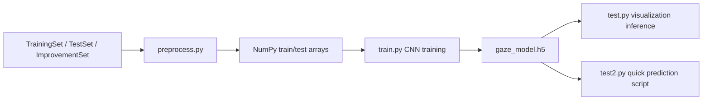

# GazeDetect

## Problem
GazeDetect tackles a computer-vision problem: predicting where a person is looking from an image of their face. That kind of gaze-direction classification can support attention tracking, human-computer interaction, and assistive interfaces.

## System Design

- Architecture:
  - preprocessing in [`preprocess.py`](C:\Users\91965\cars24\github-readme-batch\GazeDetect\preprocess.py)
  - training in [`train.py`](C:\Users\91965\cars24\github-readme-batch\GazeDetect\train.py)
  - inference and visualization in [`test.py`](C:\Users\91965\cars24\github-readme-batch\GazeDetect\test.py) and [`test2.py`](C:\Users\91965\cars24\github-readme-batch\GazeDetect\test2.py)
- Components:
  - model: a TensorFlow/Keras CNN with three convolution blocks and a final softmax classifier
  - data: grayscale face images resized to `64x64`
  - storage: local `.npy` arrays and a trained `.h5` model
- There is no LLM, DB, API server, or retrieval component in this repository.

## Approach
- Why multi-agent?
  - Multi-agent is not applicable here. This is a standard supervised vision pipeline with preprocessing, training, and inference stages.
- Why RAG?
  - RAG is not used because gaze prediction is an image-classification task, not a knowledge retrieval task.
- What the approach does:
  - loads images from three dataset sources
  - converts them to grayscale and normalizes pixel values
  - trains a CNN over three labels in the current script
  - uses saved model weights for prediction and optional visualization

## Tech Stack
- Python
- OpenCV
- NumPy
- scikit-learn
- TensorFlow / Keras
- Matplotlib

## Demo
- Run preprocessing to create `X_train.npy`, `X_test.npy`, `y_train.npy`, and `y_test.npy`
- Train the CNN and save `gaze_model.h5`
- Use `test.py` to load a sample image and visualize the predicted gaze direction
- Use `test2.py` for a simpler numeric prediction path

## Results
- The repo includes a trained model artifact, but it does not publish final accuracy, confusion matrices, or benchmark tables.
- The practical output today is a complete end-to-end prototype:
  - dataset ingestion
  - model training
  - saved model artifact
  - example inference scripts

## Learnings
- What worked:
  - grayscale conversion and fixed-size resizing make the input pipeline simple
  - separating preprocessing, training, and inference into distinct scripts keeps the workflow easy to follow
  - saving the trained model as `gaze_model.h5` makes repeated testing convenient
- What did not:
  - the class labels in [`test.py`](C:\Users\91965\cars24\github-readme-batch\GazeDetect\test.py) list nine gaze directions, while [`train.py`](C:\Users\91965\cars24\github-readme-batch\GazeDetect\train.py) currently trains a three-class output layer, so the labeling story is inconsistent
  - dataset paths are hard-coded to a local Windows directory, which makes the project harder to reproduce on another machine
  - the repo description mentions Google Drive and helper scripts in [`gzd.txt`](C:\Users\91965\cars24\github-readme-batch\GazeDetect\gzd.txt), but those helper files are not present in the checked-in code

## Supporting Docs
- [Architecture diagram](docs/architecture.png)
- [Demo preview](docs/demo_preview.png)
- [Evaluation logs and outputs](docs/evaluation.md)
- [Sample inputs and outputs](docs/sample_io.md)
- [Rich example assets](docs/examples/)
- [Representative outputs](docs/outputs/)
